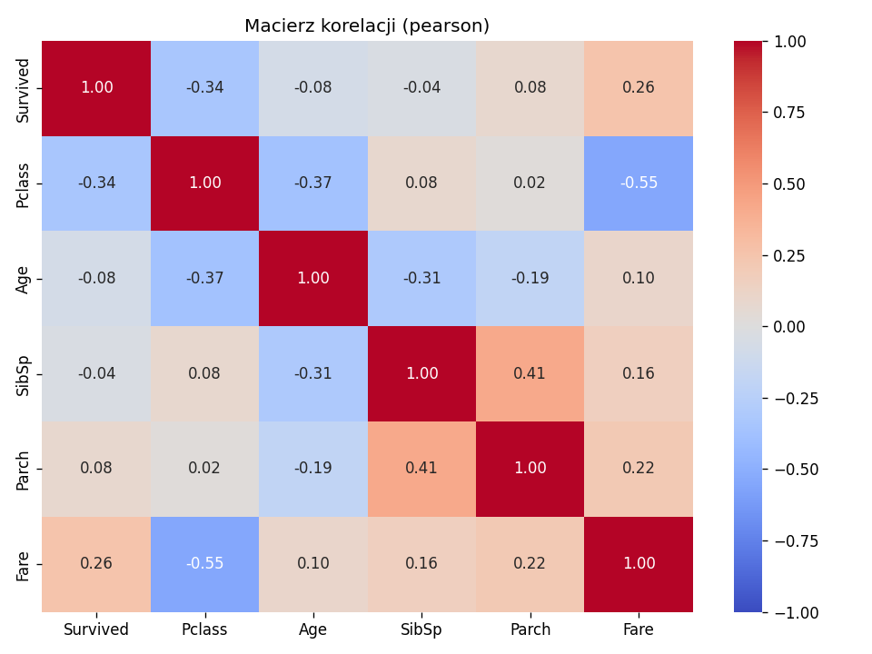
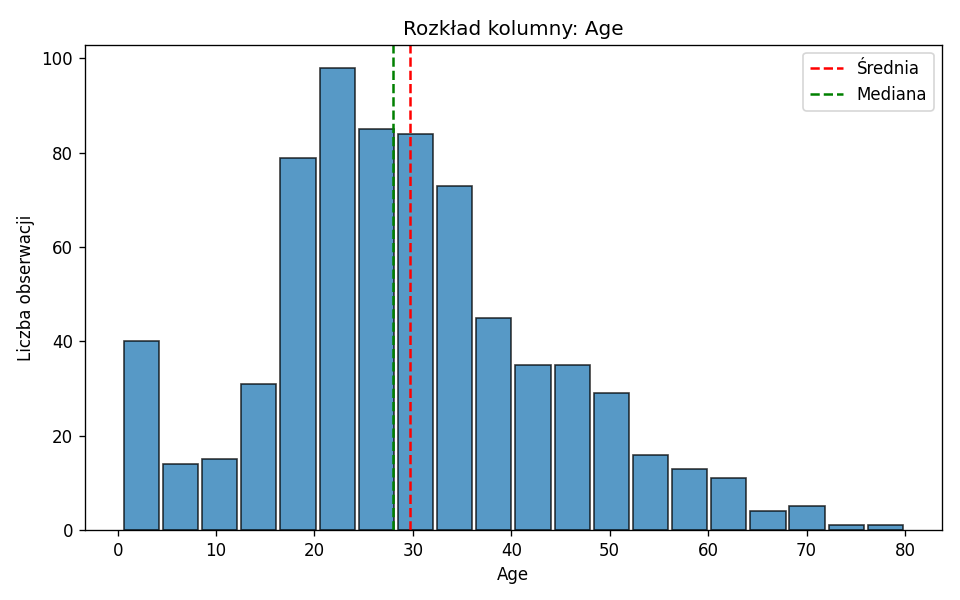
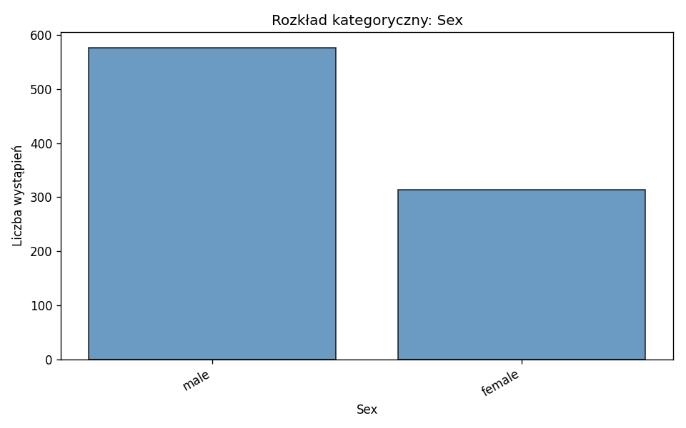
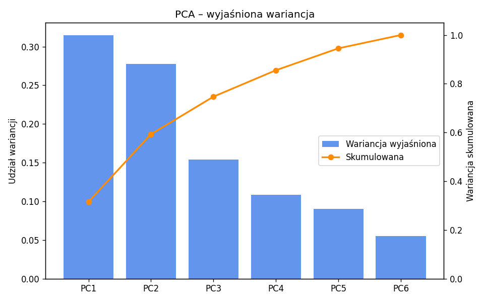
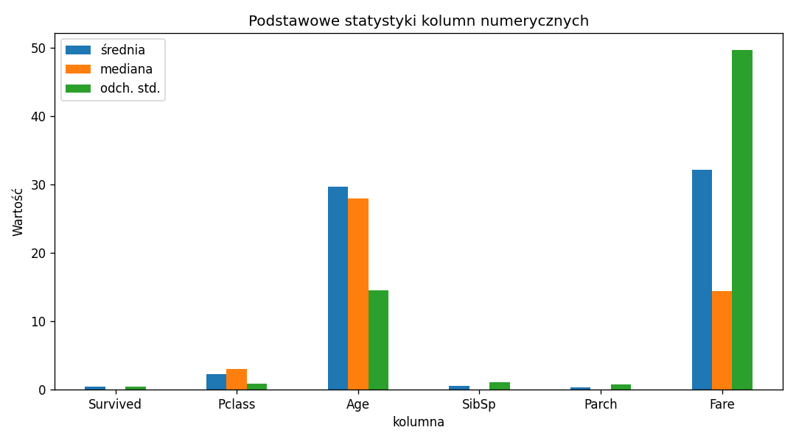

# Dokumentacja 


## Uruchomienie

```bash
cd backend
python -m venv .venv
source venv/bin/activate        
pip install -r ../requirements.txt
uvicorn main:app --reload --host 0.0.0.0 --port 8000
python -m exploration.generate_diagrams  # pokaz działania 
```

Przykładowy plik danych: `Titanic-Dataset.csv`

## Moduły projektu

| Moduł | Prefix API | Opis |
|-------|------------|------|
| **exploration** | `/exploration` | EDA typy kolumn, statystyki, korelacje, PCA, rozkłady ( moja czesc ) |
| cleaning_and_preprocessing | `/cleaning_and_preprocessing` | Imputacja, normalizacja, kodowanie, outliery |
| statistic_tests | `/statistic-tests` | Testy statystyczne |
| regresje | `/test` | Modele regresyjne |

## Moduł exploration (EDA)

Wstępna analiza przesłanego pliku CSV, wynik w JSON.  
Klasy: `DataExplorer`, `FileHandler`, `ExplorationRouter`, `DiagramGenerator`.

| Endpoint | Opis |
|----------|------|
| `POST /exploration/column-types` | Typy kolumn |
| `POST /exploration/basic-stats` | Statystyki opisowe |
| `POST /exploration/correlation` | Macierz korelacji |
| `POST /exploration/pca` | PCA |
| `POST /exploration/distribution` | Rozkład jednej kolumny |
| `POST /exploration/describe-all` | Raport zbiorczy |


### Zrzuty ekranu / diagramy

Poniżej przykładowe wyniki na zbiorze Titanic wygenerowane skryptem `generate_diagrams`

**Macierz korelacji**



**Rozkład wieku pasażerów**



**Rozkład kolumny kategorycznej (Sex)**



**PCA – wyjaśniona wariancja**



**Podstawowe statystyki**


