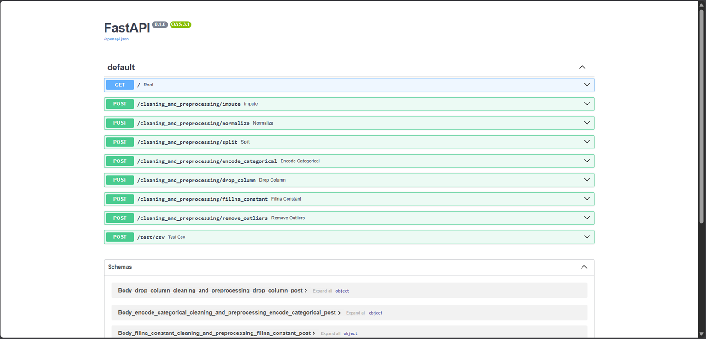
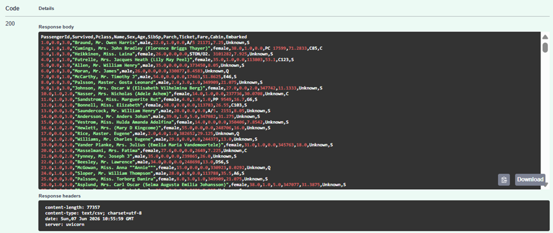
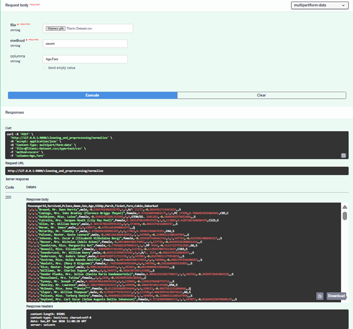
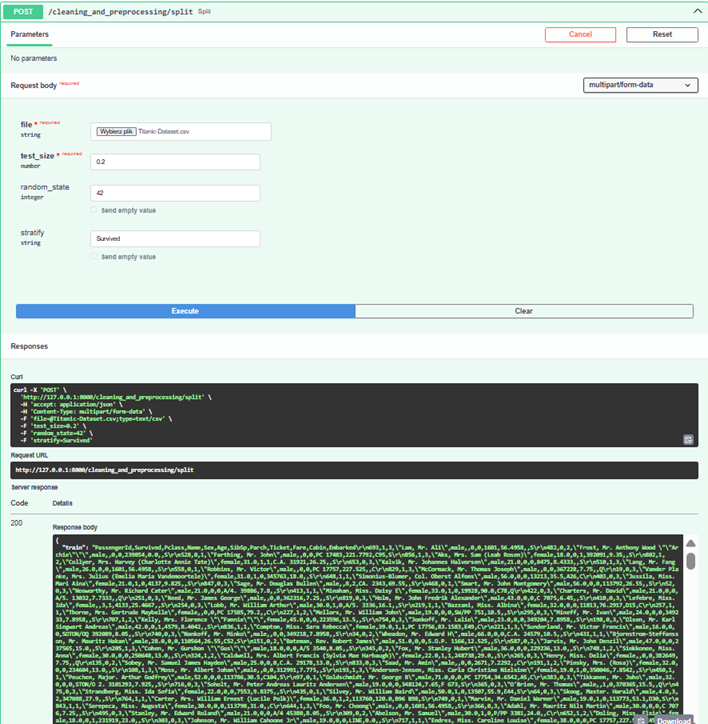
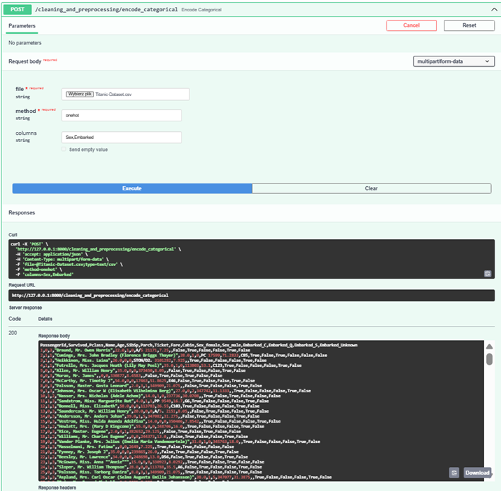
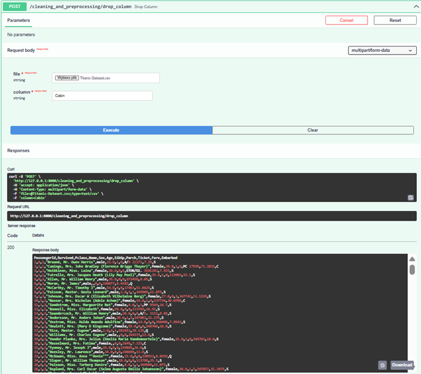
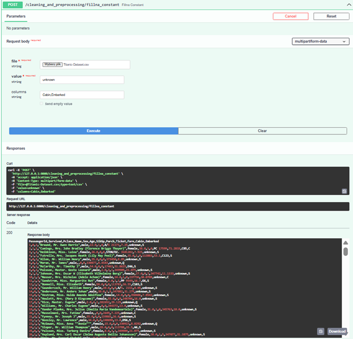
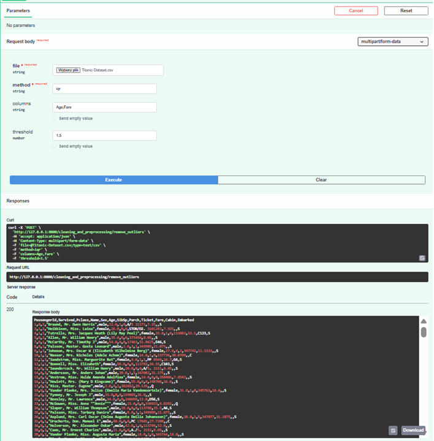

# Dokumentacja modułu Cleaning and Preprocessing

**Imię i nazwisko:** Daniel Kudła

**Data:** 07.06.2026r.

---

## 1. Wprowadzenie

Moduł **Cleaning and Preprocessing** odpowiada za czyszczenie i wstępne przetwarzanie danych tabelarycznych w formacie CSV. Udostępnia zestaw operacji preprocessingowych jako endpointy FastApi. Każda funkcjonalność jest zaimplementowana w osobnym pliku w pakiecie `cleaning_and_preprocessing/`, a routing HTTP znajduje się w pliku `main.py` w katalogu `backend/`.

Moduł przyjmuje plik CSV od użytkownika, wykonuje wybraną operację i zwraca przetworzone dane, najczęściej jako plik CSV, a w przypadku podziału zbioru (`split`) jako JSON z dwoma zestawami danych.

---

## 2. Założenia modułu

| Założenie | Opis |
|-----------|------|
| Format wejściowy | Plik CSV przesyłany w żądaniu HTTP jako pole `file` (multipart/form-data) |
| Format wyjściowy | CSV (`text/csv`) lub JSON (endpoint `split`) |
| Kodowanie plików | UTF-8 |
| Separator CSV | Automatyczne wykrywanie (przecinek, średnik itd.) |
| Brakujące wartości | Rozpoznawane jako: `N/A`, `NA`, `NULL`, `null`, `NaN`, `nan`, `None`, puste stringi |
| Walidacja danych | Nieprawidłowy plik lub parametry → odpowiedź HTTP 400 z opisem błędu |
| Wybór kolumn | Parametr `columns` (lista rozdzielona przecinkami) ogranicza operację do wskazanych kolumn |
| Architektura | Logika biznesowa w pakiecie `cleaning_and_preprocessing/`, warstwa HTTP w `main.py` |
| Wzorzec kodu | Każdy plik zawiera klasę operacyjną oraz funkcję fasadową wywoływaną z API |

---

## 3. Za co odpowiada moduł

Moduł realizuje następujące funkcjonalności:

| Funkcjonalność | Plik | Endpoint API |
|----------------|------|--------------|
| Wczytywanie i walidacja CSV | `utils.py` | (używane wewnętrznie przez wszystkie endpointy) |
| Uzupełnianie brakujących wartości (imputacja) | `impute.py` | `POST /cleaning_and_preprocessing/impute` |
| Normalizacja kolumn numerycznych | `normalize.py` | `POST /cleaning_and_preprocessing/normalize` |
| Podział na zbiór treningowy i testowy | `split.py` | `POST /cleaning_and_preprocessing/split` |
| Kodowanie zmiennych kategorycznych | `encode.py` | `POST /cleaning_and_preprocessing/encode_categorical` |
| Usuwanie kolumny | `drop.py` | `POST /cleaning_and_preprocessing/drop_column` |
| Wypełnianie braków stałą wartością | `fillna.py` | `POST /cleaning_and_preprocessing/fillna_constant` |
| Usuwanie wartości odstających (outliers) | `outliers.py` | `POST /cleaning_and_preprocessing/remove_outliers` |

---

## 4. Struktura modułu

```
backend/
├── main.py                         
├── requirements.txt                 
└── cleaning_and_preprocessing/
    ├── dokumentacja/
    │   ├── README.md                # Dokumentacja
    │   └── screenshots/             # Folder na zrzuty ekranu
    ├── utils.py                     # Narzędzia wspólne
    ├── impute.py                    # Imputacja brakujących wartości
    ├── normalize.py                 # Normalizacja danych numerycznych
    ├── split.py                     # Podział train/test
    ├── encode.py                    # Kodowanie zmiennych kategorycznych
    ├── drop.py                      # Usuwanie kolumny
    ├── fillna.py                    # Wypełnianie braków stałą wartością
    └── outliers.py                  # Usuwanie outlierów
```

## 5. Wykorzystane biblioteki

| Biblioteka | Zastosowanie |
|------------|--------------|
| **FastAPI** | Framework REST API, obsługa uploadu plików, walidacja żądań |
| **uvicorn** | Serwer ASGI |
| **pandas** | Wczytywanie, przetwarzanie i eksport danych tabelarycznych |
| **numpy** | Operacje numeryczne (np. Z-score w `outliers.py`) |
| **scikit-learn** | KNNImputer, MinMaxScaler, StandardScaler, LabelEncoder, train_test_split |
| **python-multipart** | Obsługa formularzy multipart w FastAPI |

---

## 6. Opis plików modułu

### 6.1. `utils.py`

**Odpowiedzialność:** Wspólne narzędzia do wczytywania plików CSV i walidacji kolumn. Używany przez większość pozostałych plików modułu.

**Klasa:** `DataFrameUtils`

| Metoda | Co robi |
|--------|---------|
| `read_dataframe(contents)` | Dekoduje bajty pliku (UTF-8), wczytuje CSV do DataFrame. Automatycznie wykrywa separator, rozpoznaje wartości puste/NA, usuwa całkowicie puste wiersze, przycina białe znaki w kolumnach tekstowych. Przy błędzie zwraca HTTP 400. |
| `parse_columns(columns, df)` | Dzieli parametr `columns` po przecinku i sprawdza, czy każda kolumna istnieje w DataFrame. Zwraca `None`, gdy parametr nie został podany. |
| `get_numeric_columns(df, columns)` | Zwraca listę kolumn numerycznych — z podanej listy lub ze wszystkich kolumn DataFrame. Rzuca błąd 400, gdy brak kolumn numerycznych. |

---

### 6.2. `impute.py`

**Odpowiedzialność:** Uzupełnianie brakujących wartości w danych.

**Klasa:** `Imputer`  
**Funkcja wywoływana z API:** `impute_data(df, method, columns)`

| Metoda (`method`) | Działanie |
|-------------------|-----------|
| `median` | Wypełnia braki w kolumnach numerycznych medianą danej kolumny |
| `knn` | Używa algorytmu KNN (`KNNImputer`) — uzupełnia braki na podstawie k najbliższych sąsiadów (domyślnie k=5) |

Po imputacji numerycznej kolumny kategoryczne są wypełniane wartością `"Unknown"`.

**Parametry API:** `file`, `method` (`median` / `knn`), `columns` (opcjonalnie)

---

### 6.3. `normalize.py`

**Odpowiedzialność:** Skalowanie kolumn numerycznych.

**Klasa:** `Normalizer`  
**Funkcja wywoływana z API:** `normalize_data(df, method, columns)`

| Metoda (`method`) | Działanie |
|-------------------|-----------|
| `minmax` | Skaluje wartości do zakresu [0, 1] (`MinMaxScaler`) |
| `zscore` | Standaryzacja — średnia 0, odchylenie standardowe 1 (`StandardScaler`) |

**Parametry API:** `file`, `method` (`minmax` / `zscore`), `columns` (opcjonalnie)

---

### 6.4. `split.py`

**Odpowiedzialność:** Podział zbioru danych na podzbiór treningowy i testowy.

**Klasa:** `DatasetSplitter`  
**Funkcja wywoływana z API:** `split_data(df, test_size, random_state, stratify)`

**Działanie:**
- Waliduje `test_size` musi być liczbą z zakresu (0, 1), np. `0.2` = 20% na test.
- Opcjonalnie `stratify` nazwa kolumny; zachowuje proporcje klas w obu podzbiorach.
- Opcjonalnie `random_state` ziarno generatora dla powtarzalności wyników.
- Wywołuje `train_test_split` ze scikit-learn.
- Zwraca dwa DataFrame: `train` i `test` (w API jako JSON).

**Parametry API:** `file`, `test_size`, `random_state` (opcjonalnie), `stratify` (opcjonalnie)

---

### 6.5. `encode.py`

**Odpowiedzialność:** Kodowanie zmiennych kategorycznych na postać numeryczną.

**Klasa:** `CategoricalEncoder`  
**Funkcja wywoływana z API:** `encode_data(df, method, columns)`

| Metoda (`method`) | Działanie |
|-------------------|-----------|
| `onehot` | Tworzy zmienne binarne (dummy) dla każdej kategorii (`pd.get_dummies`) |
| `label` | Przypisuje liczby całkowite kategoriom (`LabelEncoder`) |

Braki są wypełniane jako `"Unknown"`. Bez parametru `columns` kodowane są wszystkie kolumny tekstowe.

**Parametry API:** `file`, `method` (`onehot` / `label`), `columns` (opcjonalnie)

---

### 6.6. `drop.py`

**Odpowiedzialność:** Usuwanie pojedynczej kolumny z DataFrame.

**Klasa:** `ColumnDropper`  
**Funkcja wywoływana z API:** `drop_column_data(df, column)`

**Działanie:**
1. Sprawdza, czy nazwa kolumny nie jest pusta.
2. Weryfikuje istnienie kolumny w DataFrame.
3. Usuwa kolumnę i zwraca zmodyfikowany DataFrame.

**Parametry API:** `file`, `column`

---

### 6.7. `fillna.py`

**Odpowiedzialność:** Wypełnianie brakujących wartości stałą wartością podaną przez użytkownika.

**Klasa:** `ConstantFiller`  
**Funkcja wywoływana z API:** `fillna_constant_data(df, value, columns)`

**Działanie:**
- Gdy podano `columns` — wypełnia braki tylko we wskazanych kolumnach.
- Gdy `columns` jest puste — wypełnia braki we wszystkich kolumnach DataFrame.

**Parametry API:** `file`, `value`, `columns` (opcjonalnie)

---

### 6.8. `outliers.py`

**Odpowiedzialność:** Usuwanie wierszy zawierających wartości odstające w kolumnach numerycznych.

**Klasa:** `OutlierRemover`  
**Funkcja wywoływana z API:** `remove_outliers_data(df, method, columns, threshold)`

| Metoda (`method`) | Działanie | Domyślny `threshold` |
|-------------------|-----------|------------------------|
| `iqr` | Usuwa wiersze poza zakresem [Q1 − threshold×IQR, Q3 + threshold×IQR] | 1.5 |
| `zscore` | Usuwa wiersze, gdzie \|z-score\| ≥ threshold | 3 |

**Parametry API:** `file`, `method` (`iqr` / `zscore`), `columns` (opcjonalnie), `threshold` (opcjonalnie)

---

## 7. Uruchomienie i testowanie

```bash
cd backend
pip install -r requirements.txt
pip install scikit-learn
uvicorn main:app --reload
```

Dokumentacja interaktywna API (Swagger UI): `http://127.0.0.1:8000/docs`

Przykład wywołania (curl):

```bash
curl -X POST "http://127.0.0.1:8000/cleaning_and_preprocessing/impute" \
  -F "file=@Titanic-Dataset.csv" \
  -F "method=median" \
  -F "columns=Age,Fare"
```

---

## 8. Zrzuty ekranu — wyniki testów funkcjonalności

---

### 8.1. Swagger UI



---

### 8.2. Imputacja brakujących wartości (`impute`)



---

### 8.3. Normalizacja danych (`normalize`)




---

### 8.4. Podział zbioru (`split`)



---

### 8.5. Kodowanie kategoryczne (`encode_categorical`)



---

### 8.6. Usuwanie kolumny (`drop_column`)



---

### 8.7. Wypełnianie braków stałą wartością (`fillna_constant`)



---

### 8.8. Usuwanie outlierów (`remove_outliers`)



---

## 9. Podsumowanie

Moduł **Cleaning and Preprocessing** stanowi kompletny zestaw narzędzi do przygotowania danych CSV przed dalszą analizą lub uczeniem modeli. Każda funkcjonalność jest niezależnym endpointem, co umożliwia elastyczne łączenie operacji po stronie klienta.
